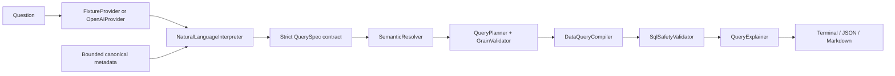

# ZuQL

[English](README.md) | [简体中文](README.zh-CN.md) | [日本語](README.ja.md)

ZuQL is a conservative, domain-specific natural-language interface to the
public Zuora data model. It turns a supported business question into
deterministic, validated Zuora Data Query SQL and a human-readable explanation.

ZuQL is designed for SQL preview and developer tooling. It does **not** connect
to a tenant or execute the generated query.

## What it does

- Interprets a natural-language question as a strict, typed business intent.
- Resolves business terms against curated objects, fields, metrics, and
  dimensions.
- Plans joins using reviewed relationships only.
- Detects unsafe grain and fan-out before compilation.
- Emits deterministic SQL from registry-approved physical identifiers.
- Explains resolutions, filters, metrics, joins, grain, assumptions, mapping
  confidence, warnings, and SQL.
- Supports an offline fixture provider and a live OpenAI Responses API provider.
- Produces terminal, JSON, and Markdown output from a CLI or Ruby API.

## What it does not do

- It is not a general-purpose text-to-SQL engine.
- It does not execute SQL, authenticate to Zuora, or download query results.
- It does not discover tenant schemas, custom fields, or enabled features.
- It does not guarantee that the public canonical model matches a tenant.
- It does not accept model-generated SQL, physical table names, joins, or
  backend selection.
- It does not silently rewrite unsafe fan-out; unsafe requests fail closed.

## Quick start

### Requirements

- Ruby 3.3 or newer
- Bundler

### Run from source

```sh
git clone <repository-url>
cd ZuQL
bundle install
bundle exec exe/zuql --list-examples
bundle exec exe/zuql "Count active subscriptions"
```

Offline mode is the default. It is deterministic, network-free, and accepts
the exact examples in `data/fixtures/query_interpretations.yml`.

Useful commands:

```sh
bundle exec exe/zuql --list-domains
bundle exec exe/zuql "Count active subscriptions" --json result.json
bundle exec exe/zuql "Count active subscriptions" --markdown result.md
bundle exec exe/zuql --help
```

Exports use exclusive file creation and never overwrite an existing file.

### Use the live provider

The live provider interprets previously unseen supported questions. Planning
and SQL generation remain deterministic and application-controlled.

```sh
export OPENAI_API_KEY='your-key'
export ZUQL_OPENAI_MODEL='gpt-5.6-sol' # optional default
bundle exec exe/zuql --live "Show current MRR by account"
```

Credentials are read from the environment and sent only in the authorization
header. Optional controls are `ZUQL_PROVIDER_OPEN_TIMEOUT`,
`ZUQL_PROVIDER_READ_TIMEOUT`, `ZUQL_PROVIDER_MAX_ATTEMPTS`,
`ZUQL_PROVIDER_MAX_RESPONSE_BYTES`, and `ZUQL_OPENAI_ENDPOINT`.

### Ruby API

```ruby
require 'zuql'

provider = ZuQL::Providers::FixtureProvider.from_yaml
interpreter = ZuQL::NaturalLanguageInterpreter.new(provider: provider)
pipeline = ZuQL::Pipeline.new(interpreter: interpreter)

result = pipeline.call('Count active subscriptions')
puts result.compiled_query.sql
puts ZuQL::Renderers::JsonRenderer.new.render(result)
```

## Architecture for developers



The trust boundary is intentionally narrow:

1. `MetadataRetriever` selects a bounded slice of canonical metadata.
2. `NaturalLanguageInterpreter` asks a provider for structured intent and
   validates it against a versioned JSON Schema. The provider cannot choose
   SQL, joins, physical identifiers, or the backend.
3. `SemanticResolver` converts business concepts into canonical IDs.
4. `QueryPlanner`, `RelationshipGraph`, and `GrainValidator` select reviewed
   paths and reject ambiguous, disconnected, or unsafe plans.
5. `DataQueryCompiler` emits the documented SQL subset using validated registry
   mappings only.
6. `SqlSafetyValidator` recompiles the typed plan and verifies the artifact.
7. `QueryExplainer` and the renderers expose both the result and its provenance.

The offline and live providers share every stage after the provider boundary,
so fixture tests exercise the production resolver, planner, compiler, and
safety validation path.

### Repository map

| Path | Purpose |
| --- | --- |
| `lib/zuql/contracts.rb` | Immutable contracts between pipeline stages |
| `lib/zuql/providers/` | Offline and live interpretation adapters |
| `lib/zuql/semantic_resolver.rb` | Deterministic concept resolution |
| `lib/zuql/query_planner.rb` | Root, join path, projection, and grain planning |
| `lib/zuql/data_query_compiler.rb` | Registry-bound Data Query SQL compilation |
| `lib/zuql/sql_safety_validator.rb` | Compiler provenance and mutation checks |
| `data/canonical/` | Reviewed public semantic and physical metadata |
| `data/fixtures/` | Offline interpretations and golden questions |
| `schemas/` and `prompts/` | Versioned provider boundary |
| `spec/` | Unit, integration, security, and golden tests |

## Development

```sh
bundle install
bundle exec rake spec           # tests and coverage floor
bundle exec rubocop             # lint
bundle exec rake metadata_audit # canonical artifact integrity/staleness
bundle exec rake                # standard local checks
bundle exec rake release_gate   # full build/install/release verification
```

The release gate additionally verifies the 20+ question corpus, builds the gem,
installs it with its declared dependencies into an isolated `GEM_HOME`, and
smoke-tests the installed CLI. CI runs the quality suite on Ruby 3.3, 3.4, and
4.0 before allowing the release gate to pass.

Maintainers can regenerate the extracted source dataset offline from the local
HTML corpus:

```sh
bundle exec ruby scripts/extract_data_sources
```

See the [supported SQL subset](docs/DATA_QUERY_SQL_SUBSET.md),
[MVP release guide](docs/MVP_RELEASE.md), and
[implementation plan](docs/MVP_IMPLEMENTATION_PLAN.md) for the detailed
contracts and release evidence.

## Known limitations and possible future work

The following are not in the MVP. They may be supported in future releases,
but are not commitments:

- Live Zuora Data Query authentication, submission, polling, and export retrieval.
- Tenant schema discovery, tenant overlays, custom fields, and feature profiles.
- Snowflake compilation or execution.
- Automatic fan-out-safe rewrites using pre-aggregation, CTEs, semi-joins, or
  multi-stage plans.
- Broader semantic retrieval such as fuzzy or embedding-based matching.
- Additional live LLM providers.
- Browser-based documentation crawling and snapshot infrastructure.
- An HTTP API, web UI, hosted service, user accounts, authorization, audit
  logging, and billing.
- Legacy Amendment-first models, legacy InvoicePayment, Revenue Recognition,
  and complete BI/dashboard coverage.

Until tenant read-only validation is available, every result retains the public
canonical model warning and mapping status. Unknown or unsafe behavior should
be treated as an error, not guessed.

## Security model

- Untrusted provider output is parsed into a strict schema and cannot contain SQL.
- Registry metadata is the only source of physical identifiers and joins.
- Errors are sanitized and do not expose provider bodies, credentials, SQL,
  filesystem paths, or backtraces.
- JSON and Markdown exports never overwrite existing files.
- RubyGems MFA is required by package metadata.

Please report security issues privately to the maintainers rather than opening
a public issue containing credentials or tenant data.

## License

ZuQL is available under the [MIT License](LICENSE.txt).
